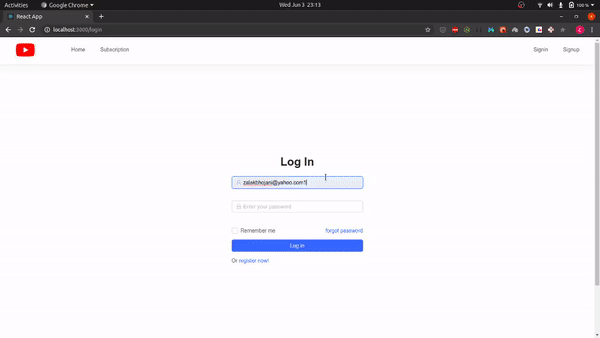

# Youtube-clone -- MERN stack

 

## About

An attempt to create a site similar to youtube, creating basic functionalities of Youtube using MERN stack.

## Build Setup

In the project directory, run this command to install server dependencies:

### `npm install`

In the project subdirectory - 'Youtube-clone/client', run this command to install server dependencies:

### `npm install`

In order to run the application:

Running server and client concurrently in development mode
### `npm run dev`   
Open [http://localhost:5000](http://localhost:5000) to view it in the browser.

The page will reload automatically if you make edits. 
You will also see any lint errors in the console.

## MongoDB Connection (Database)

Open "Youtube-clone/server/config" and create "dev.js" 
### `module.exports = {   mongoURI: 'mongodb+srv://<username>:<password>@cluster0-nwq7d.mongodb.net/test?retryWrites=true&w=majority'}
Replace <password> with the password for the user <username>
to setup MongoDB environment

### Requirements

ffmpeg on developer machine (used to generate metadata about thumbnail)

## Demo

## Add-Ons

- [X] Creating Thumbnails using ffmpeg
- [X] Creating subscribed videos routing
- [ ] Adding depencies and their usage for futher usage
- [ ] Understand caching and implementing it
- [ ] Implementing notification when subscribed videos drop

## Deployment

In progress

